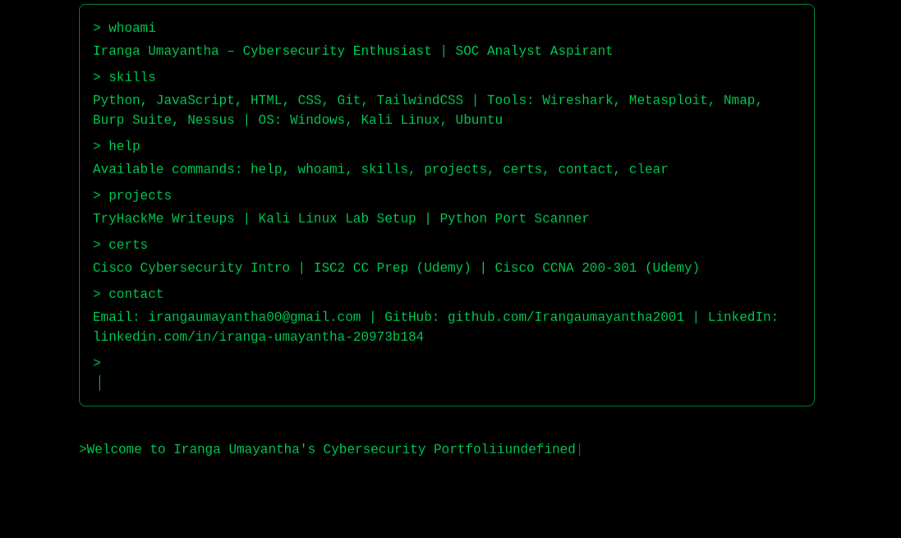

# 🛡️ Iranga Umayantha - Cybersecurity Portfolio

Welcome to my interactive, terminal-style cybersecurity portfolio built with **Next.js**, **Tailwind CSS**, and custom animations. This project showcases my hands-on experience, certifications, and projects in cybersecurity, ethical hacking, and IT support.

 <!-- Optional: Replace with actual image path -->

---


## 📌 Features

- 🖥️ Terminal-style UI with blinking cursor and animations
- ⌨️ Typing sound effects for enhanced realism
- 📂 Interactive command input (e.g., `whoami`, `skills`, `projects`, etc.)
- 🧠 Clean layout powered by **Next.js** and **Tailwind CSS**
- 🌐 Deployed with Vercel for high performance

---

## 📖 Available Commands

Inside the terminal interface:

```bash
> help         # List all commands
> whoami       # About me
> skills       # Programming & cybersecurity tools
> projects     # Projects and labs
> certs        # Certifications (Cisco, ISC2, Udemy)
> contact      # My email, GitHub, LinkedIn
> clear        # Clears the terminal


🛠️ Tech Stack

Next.js

Tailwind CSS

React Hooks (useState, useEffect)

Custom animation with Tailwind config

Vercel Hosting

📸 Screenshots


📬 Contact
Email: irangaumayantha00@gmail.com

LinkedIn: linkedin.com/in/iranga-umayantha-20973b184

GitHub: github.com/Irangaumayantha2001

🔖 License
This project is open-source under the MIT License.

